## Hướng dẫn cấu hình NGINX với MariaDB Cluster trên CentOS 7

### Menu

- [1. Giới thiệu](#)
- [2. Các bước tiến hành](#)
	- [2.1 Cài đặt Galera trên 3 node](#)
	- [2.2 Cài đặt NGINX làm Load-balancer](#)
- [3. Kiểm tra](#)

<a name="1"></a>
### 1. Giới thiệu

NGINX được biết đến là một Web Server khá nổi tiếng. Nhưng nó cũng là một load-balancer đầy mạnh mẽ. Bài viết này sẽ hướng dẫn các bạn sử dụng NGINX làm một load-balancer cho MariaDB/MySQL trên CentOS 7.

#### Mô hình cài đặt

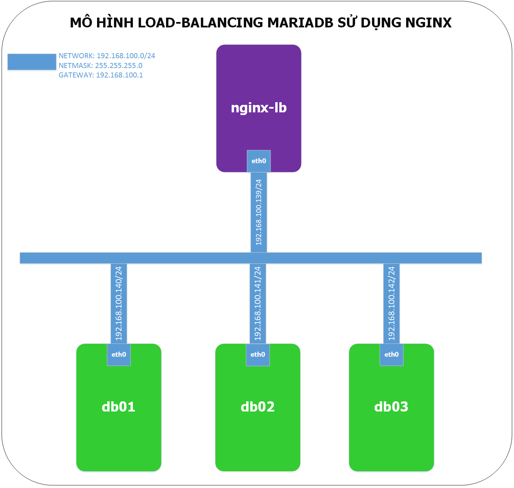

#### IP Planning

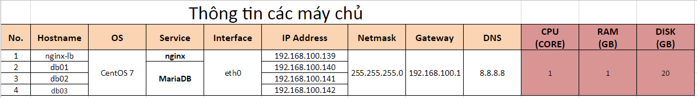

<a name="2"></a>
### 2. Các bước tiến hành

<a name="21"></a>
#### 2.1 Cài đặt Galera trên 3 node

- **Bước 1**: Thêm repo cho MariaDB

Trên các node `db01`, `db02` và `db03` chúng ta cài đặt MariaDB lên 3 node này. Để cài đặt được MariaDB, chúng ta phải thêm repo cho chúng.

**Tạo file repo**

```
vi /etc/yum.repos.d/MariaDB.repo
```

**Thêm nội dung sau:**

```
[mariadb]
name = MariaDB
baseurl = http://yum.mariadb.org/10.1/centos7-amd64
gpgkey=https://yum.mariadb.org/RPM-GPG-KEY-MariaDB
gpgcheck=1
```

- **Bước 2**: Thêm thông tin các host vào file `/etc/hosts`

```
vi /etc/hosts
```

Chèn thêm thông tin các host

```
...
192.168.100.140 db01
192.168.100.141 db02
192.168.100.142 db03
```
Lưu và thoát khỏi file.

- **Bước 3**: Cài đặt MariaDB trên lần lượt các node `db01`, `db02` và `db03`

```
yum install mariadb-server rsync
```

*Chờ khoảng 5-10p cho quá trình cài đặt diễn ra thành công.*

- **Bước 4**: Cấu hình Galera cho các node

Tạo file cấu hình Galera trên từng node với nội dung:

```
vi /etc/my.cnf.d/galera.cnf
```

Với node `db01`:

```
[galera]
# Mandatory settings
wsrep_on=ON
wsrep_provider=/usr/lib64/galera/libgalera_smm.so

#add your node ips here
wsrep_cluster_address="gcomm://192.168.100.140,192.168.100.141,192.168.100.142"
binlog_format=row
default_storage_engine=InnoDB
innodb_autoinc_lock_mode=2
#Cluster name
wsrep_cluster_name="galera_cluster"
# Allow server to accept connections on all interfaces.

bind-address=0.0.0.0

# this server ip, change for each server
wsrep_node_address="192.168.100.140"
# this server name, change for each server
wsrep_node_name="db01"

wsrep_sst_method=rsync
```

Sau đó lưu lại và thoát.

Tương tự trên `db02` và `db03`, chúng ta cũng tạo file trên và sửa thông tin cho đúng với từng node ở 2 trường `wsrep_node_address` và `wsrep_node_name`.

- **Bước 5:** Tắt SELinux và tường lửa Firewalld

Tắt tức thời trên từng node bằng lệnh:

```
setenforce 0
```

Chỉnh sửa file cấu hình của SELinux:

```
vi /etc/sysconfig/selinux
```

Sửa dòng `SELINUX=enforcing` thành `SELINUX=disabled`.

Nếu bạn sử dụng firewalld vui lòng thêm những rule sau:

```
firewall-cmd --permanent --add-port=3306/tcp
firewall-cmd --permanent --add-port=4567/tcp
firewall-cmd --permanent --add-port=873/tcp
firewall-cmd --reload
```

- **Chú thích**:

	- `3306` là port cho phép client truy vấn vào DB
	- `4567` Port liên hệ của cluster
	- `873` rsync đồng bộ dữ liệu với nhau


- **Bước 6**: Khởi động Galera Cluster

Đầu tiên trên `db01`, chúng ta đặt nó làm node master với lệnh sau:

```
galera_new_cluster
```

Sau khi lệnh trên được thực hiện thành công, chúng ta lần lượt chuyển sang 2 node còn lại và chạy lệnh

```
systemctl start mariadb
```

- **Bước 7**: Kiểm tra cluster đã hoạt động

```
mysql -u root -e "SHOW STATUS LIKE 'wsrep_cluster_size'"
```


- **Bước 7**: Cài đặt cơ bản MariaDB

Tiếp đến, chúng ta sử dụng script `mysql_secure_installation` cài đặt cơ bản MariaDB.

```
mysql_secure_installation
```

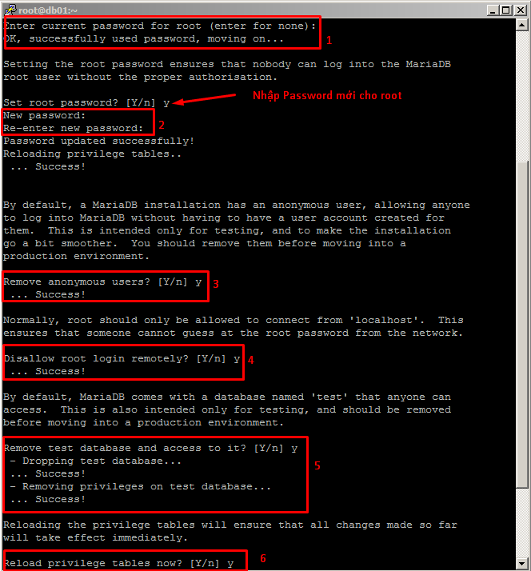

- **Chú ý**
	
	- Làm bước này trên cả 3 node `db01`, `db02` và `db03`
	- `1` Nhập mật khẩu cũ. Do mới cài đặt, mật khẩu cũ là trống nên chúng ta bấm enter để chuyển qua bước tiếp theo.
	- `2` Chọn Y để đặt Password cho user `root` của MariaDB
	- `3` Xóa user anonymous
	- `4` Cho phép login root trên localhost
	- `5` Xóa database tên `test`
	- `6` Phân lại quyền trên các bảng

<a name="22"></a>
#### 2.2 Cài đặt NGINX làm Load-balancer

Các bước làm trên máy chủ `nginx-lb`.

- **Bước 1**: Cài đặt các trình biên dịch

Để cài đặt nginx từ source, chúng ta phải cài đặt thêm cho máy chủ các trình biên dịch.

```
yum -y install gcc gcc-c++ pcre-devel zlib-devel \
libxml2-devel curl-devel libjpeg-devel libpng-devel \
libXpm-devel freetype-devel openldap-devel wget
```

- **Bước 2**: Tải `nginx` từ trang chủ

Chúng ta tải bản mới nhất từ [trang chủ](http://nginx.org/download/)

```
wget http://nginx.org/download/nginx-1.11.13.tar.gz
```

- **Bước 3**: Giải nén source code

```
tar -xzf nginx-1.11.13.tar.gz
```

- **Bước 4**: Biên dịch source

```
cd nginx-1.11.13

./configure --prefix=/etc/nginx --sbin-path=/usr/sbin/nginx \
 --conf-path=/etc/nginx/nginx.conf \
 --error-log-path=/var/log/nginx/error.log \
 --http-log-path=/var/log/nginx/access.log \
 --pid-path=/var/run/nginx.pid --lock-path=/var/run/nginx.lock \
 --http-client-body-temp-path=/var/cache/nginx/client_temp \
 --http-proxy-temp-path=/var/cache/nginx/proxy_temp \
 --http-fastcgi-temp-path=/var/cache/nginx/fastcgi_temp \
 --http-uwsgi-temp-path=/var/cache/nginx/uwsgi_temp \
 --http-scgi-temp-path=/var/cache/nginx/scgi_tem \
 --with-http_stub_status_module \
 --with-http_ssl_module \
 --with-stream
 
make

make install
```

- **Bước 5**: Cấu hình nginx

Sau khi cài đặt xong, chúng ta mở file cấu hình của nginx và thêm vào những dòng sau:

```
vi /etc/nginx/nginx.conf
```

```
...
stream {
      upstream stream_backend {
        zone tcp_servers 64k;
        server 192.168.100.140:3306;
        server 192.168.100.141:3306;
        server 192.168.100.142:3306;
    }
    server {
        listen 3306;
        proxy_pass stream_backend;
        proxy_connect_timeout 1s;
    }
}
```

Chú ý: Cấu hình PID cho NGINX, bằng cách thêm hoặc chỉnh sửa dòng

```
pid        /var/run/nginx.pid;
```

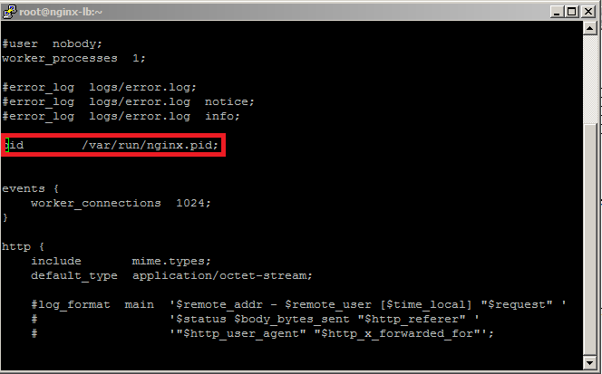


Lưu lại file và thoát.

- **Bước 6**: Thêm systemd cho nginx

Tạo file systemd cho nginx

```
vi /lib/systemd/system/nginx.service
```

Nội dung như sau:

```
[Unit]
Description=The NGINX HTTP and reverse proxy server
After=syslog.target network.target remote-fs.target nss-lookup.target

[Service]
Type=forking
PIDFile=/run/nginx.pid
ExecStartPre=/usr/sbin/nginx -t
ExecStart=/usr/sbin/nginx
ExecReload=/bin/kill -s HUP $MAINPID
ExecStop=/bin/kill -s QUIT $MAINPID
PrivateTmp=true

[Install]
WantedBy=multi-user.target
```

Phân quyền cho script:

```
chmod +x /lib/systemd/system/nginx.service
```

- **Bước 7**: Khởi động nginx

```
systemctl restart nginx
systemctl enable nginx
```

Kiểm tra bằng lệnh:

```
ss -npl | grep 3306
```

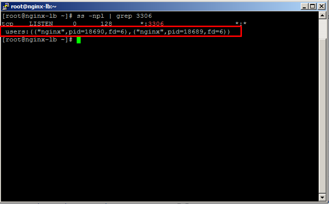

Như vậy, nginx đã hoạt động và lắng nghe với port 3306.

<a name="3"></a>
### 3. Kiểm tra

- **Bước 1**: Tạo user có quyền trên anyhost

Trên host `db01`, chúng ta đăng nhập vào mysql và tạo user `root` với quyền đăng nhập anyhost (%).

```
mysql -u root -p
```

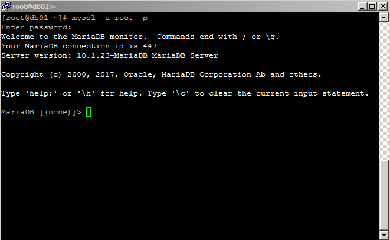

Đăng nhập bằng password mà bạn đã đổi ở bên trên.

Tạo user và phân quyền.

```
CREATE USER 'root'@'%' IDENTIFIED BY 'password';
GRANT ALL PRIVILEGES ON *.* TO 'root'@'%';
```

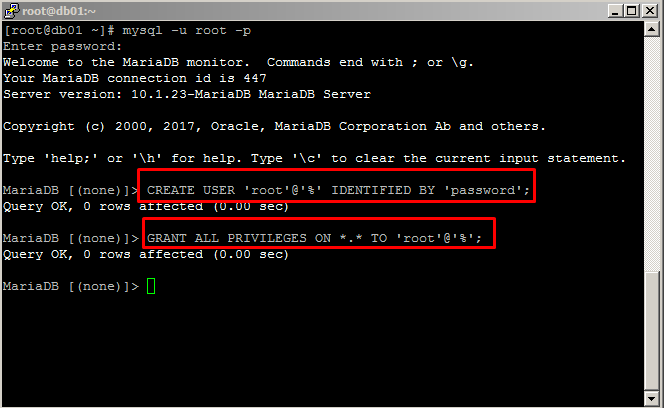

**Chú ý**: Thay `password` bằng mật khẩu bạn muốn đặt.

- **Bước 2**: Kết nối vào DB theo IP của nginx-lb

Cũng tại server `db01`, chúng ta kết nối tới Database bằng địa chỉ của `nginx-lb`

```
mysql -u root -p -h 192.168.100.139
```

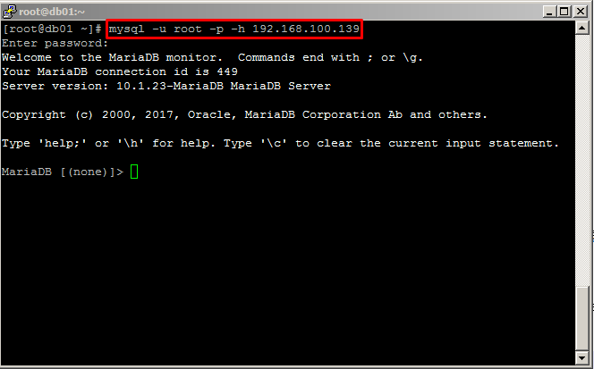

Chuyển xuống bước tiếp theo để tạo mới một database.

- **Bước 3**: Tạo DB `test` và xem lại

```
CREATE DATABASE test;
SHOW DATABASES;
```

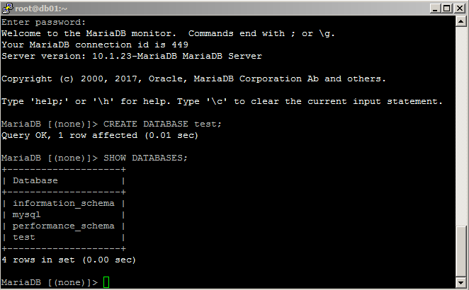

- **Bước 4**: Kiểm tra trên còn lại host.

```
mysql -u root -p
SHOW DATABASES;
```

Trên `db02`:

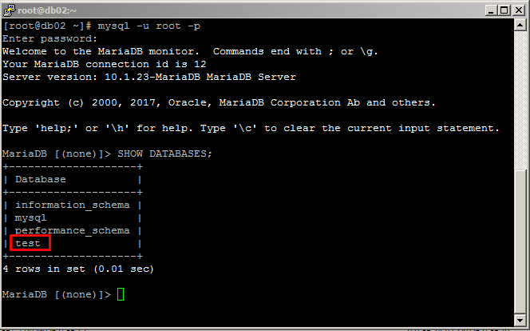

Trên `db03`:

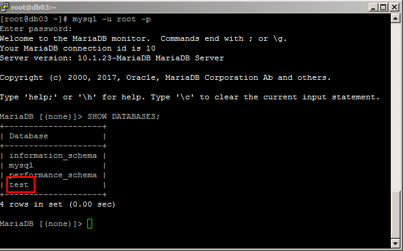

### Tham khảo:

- http://linoxide.com/cluster/mariadb-centos-7-galera-cluster-haproxy/
- https://hack.idv.tw/wordpress/?p=4871